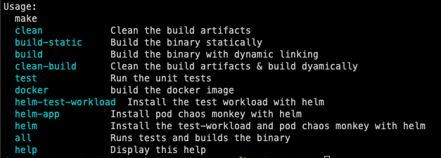

# Pod Chaos Monkey

## Introduction

This app serves as an example on how to introduce some chaos in a Kubernetes namespace. It will delete a pod at random in a particular namespace when it matches an a label selector. The default label selector is "podchaosmonkey=true"

## Project Structure

```shell
    .
    ├── .github                 # Github Actions
      ├── workflows
    ├── charts                  # Helm Charts
      ├── podchaosmonkey        # Chart for the app
      ├── test-workload         # Chart for the testing app
    ├── pkg                     # Application Packages
      ├── chaos                 # Chaos Engineering main package for the app
      ├── environment           # Environment variables utility functions
    └── readme.md
```

## How does it work?

If we're using this from outside a Kubernetes Cluster (i.e. as a Standalone Binary or while developing) we can set the `KUBECONFIG` environment variable with a filepath. Otherwise the program will default to use the default in-cluster config.

If we want to set the KUBECONFIG we can do so like this:

```shell
KUBECONFIG=~/.kube/config
```

This app will attempt to delete pods in a Running State and will not delete pods with Finalizers set. Finalizers are set to prevent resources from being deleted and are usually managed by Kubernetes Operators that take care of the lifecycle of these pods. If you still want to delete pods with Finalizers set you can do so by setting the `INCLUDE_FINALIZERS` environment variable to `true`."

## Configuration

The application can be configured with the following environment variables:

| Variable             | Default               | Description                                                                                     |
| -------------------- | --------------------- | ----------------------------------------------------------------------------------------------- |
| KUBECONFIG           | `none` **(optional)** | Set the filepath for the KUBECONFIG file you wish to use.                                       |
| NAMESPACE            | `workloads`           | Namespace that the chaos-monkey-app uses to kill pods                                           |
| INTERVAL_SECONDS     | `10`                  | Time in seconds between pod deletes                                                             |
| GRACE_PERIOD_SECONDS | `5`                   |                                                                                                 |
| LABELS               | `podchaosmonkey=true` | This label needs to be set on the pod Spec for the elegible workloads on the selected namespace |
| INCLUDE_FINALIZERS   | `false`               | Allows the deletion of pods with finalizers set.                                                |

## Building instructions

Only prerequisites to build the app are make and `go` or `docker`. There's a makefile with a bunch of commands and shows an help menu by default.



**_Go build_**

```shell
go build -o bin/podchaosmonkey .
```

**Docker build**

```shell
docker build -t podchaosmonkey:latest .
```

**Deploy the app on kubernetes and the `test-workloads` alongside it**

```shell
helm upgrade --install test ./charts/testworkload --namespace workloads --create-namespace
helm upgrade --install test ./charts/podchaosmonkey --namespace workloads --create-namespace
```
